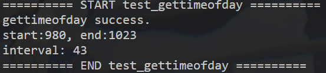
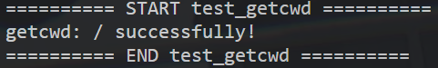
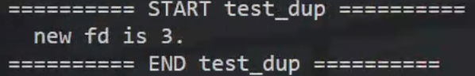
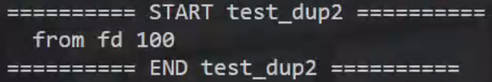
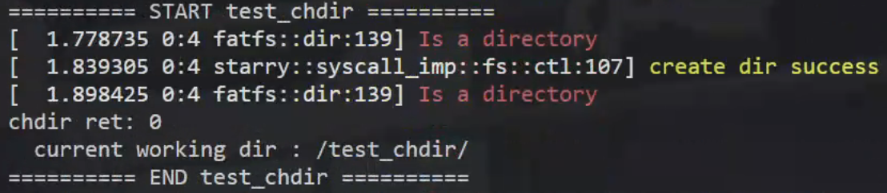
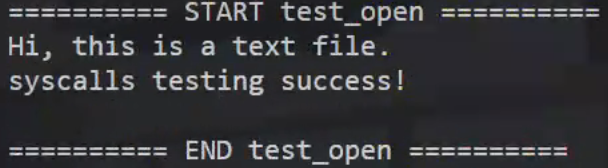
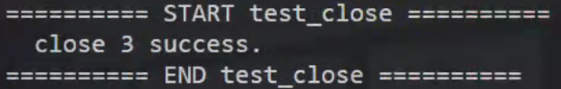
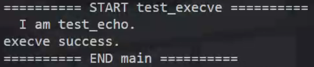
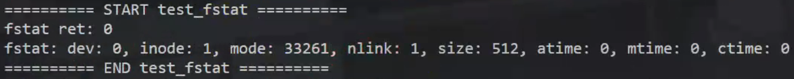
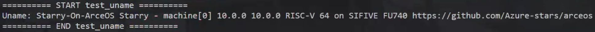

# Starry-On-ArceOS


### 1.从文件加载测例

修改依赖文件

```shell
# 修改 ./scripts/get_deps.sh 中的 arceos-org/arceos 为 Azure-stars/Starry

./scripts/get_deps.sh
./build_img.sh -a riscv64 -file base_riscv64 # 打包测例
mv disk.img ./.arceos
make run ARCH=riscv64 BLK=y FEATURES=fs # 运行内核
```

修改Cargo.toml

```toml
axstd = { path = ".arceos/ulib/axstd", features = ["paging"] }
axhal = { path = ".arceos/modules/axhal", features = ["uspace"] }
axmm = { path = ".arceos/modules/axmm" }
axtask = { path = ".arceos/modules/axtask" }
axsync = { path = ".arceos/modules/axsync" }
axruntime = { path = ".arceos/modules/axruntime", features = ["multitask"] }
arceos_posix_api = { path = ".arceos/api/arceos_posix_api" }
axfs = { path = ".arceos/modules/axfs" }
```

修改load.rs load_elf

```rust
pub(crate) fn load_elf(name: &str, base_addr: VirtAddr) -> ELFInfo {
    let data_vec = read(name).expect("can't find app in disk");
    let data;
    unsafe {
        data = core::slice::from_raw_parts(&data_vec[0] as *const u8, data_vec.len());
    }
    let elf = ElfFile::new(data).expect("invalid ELF file");

    // let elf = ElfFile::new(
    //     get_app_data_by_name(name).unwrap_or_else(|| panic!("failed to get app: {}", name)),
    // )
    // .expect("invalid ELF file");
}
```

修改main.rs

```rust
fn run_test_from_disk(name: &str) {
    let (entry_vaddr, ustack_top, uspace) = mm::load_user_app(name).unwrap();
    let user_task = task::spawn_user_task(
        Arc::new(Mutex::new(uspace)),
        UspaceContext::new(entry_vaddr.into(), ustack_top, 2333),
    );
    let exit_code = user_task.join();
}

#[no_mangle]
fn main() {
    run_test_from_disk("gettimeofday");
}
```


### 2. gettimeofday

```rust
// Starry-On-ArceOS/src/syscall_imp/time.rs
use arceos_posix_api::api::ctypes::timeval;
use axhal::time::wall_time;

pub(crate) fn sys_gettimeofday(tv: *mut timeval) -> isize {
    if tv.is_null() {
        return -1;
    }

    let _tv = wall_time().into();

    unsafe {
        *tv = _tv;
    }

    0
}
```




### 3. getcwd

```rust
// Starry-On-ArceOS/src/syscall_imp/fs/ctl.rs

use axtask::{current, TaskExtRef};
use memory_addr::VirtAddr;
pub(crate) fn sys_getcwd(buf: *mut u8, len: usize) -> isize {
    // 使用api获取cwd
    let cwd = axfs::api::current_dir().expect("get cwd fail");
    let cwd = cwd.as_bytes();

    if cwd.len() <= len {
        // buf是虚拟地址，获取当前地址空间以写入物理地址
        let curr = current();
        let curr_ext = curr.task_ext();
        let mut aspace = curr_ext.aspace.lock();
        
        aspace.write(VirtAddr::from_ptr_of(buf), cwd);

        buf as isize
    } else {
        warn!("len isn't enough.");
        0
    }
}
```




### 4.dup

修改Cargo.toml，启用fd feature

```toml
- arceos_posix_api = { path = ".arceos/api/arceos_posix_api"}
+ arceos_posix_api = { path = ".arceos/api/arceos_posix_api", features = ["fd"] }
```

```rust
// Starry-On-ArceOS/src/syscall_imp/fs/ctl.rs

use core::ffi::c_int;
use arceos_posix_api::sys_dup as dup;
pub(crate) fn sys_dup(old_fd: c_int) -> isize {
    dup(old_fd) as isize
}
```



### 5.dup3

```rust
// Starry-On-ArceOS/src/syscall_imp/fs/ctl.rs

use arceos_posix_api::sys_dup2 as dup2;
pub(crate) fn sys_dup2(old_fd: c_int, new_fd: c_int) -> isize {
    dup2(old_fd, new_fd) as isize
}
```



### 6.mkdirat

```rust
use alloc::format;
use alloc::string::String;
fn get_path(path: *const u8) -> String {
    let curr = current();
    let curr_ext = curr.task_ext();
    let mut aspace = curr_ext.aspace.lock();
    
    let mut path = path as usize;
    let mut buf: [u8; 128] = [0; 128];
    let mut idx = 0;
    let mut c: [u8; 1] = [0];
    while idx < 128 {
        aspace.read(VirtAddr::from_ptr_of(path as *const u8), &mut c);
        if c[0] == 0 {
            break;
        } else {
            buf[idx] = c[0];
            idx += 1;
            path += 1;
        }
    }
    
    let mut res = String::new();
    unsafe {
        let tmp = core::str::from_utf8_unchecked(&buf[..idx]);
        res = format!("{}{}", res, tmp);
        
    }

    res
}

pub(crate) fn sys_chdir(path: *const u8) -> isize {
    let mut path = get_path(path);
    axfs::api::set_current_dir(path.as_str());
    0
}

pub(crate) fn sys_mkdirat(dirfd: usize, path: *const u8, mode: u32) -> isize {
    let cwd = axfs::api::current_dir().unwrap(); // "/"
    let mut path = get_path(path); // "test_chdir"
    let res = format!("{}{}/", cwd, path); // "/test_chdir/"

    if dirfd == -100isize as usize {
        if axfs::api::path_exists(path.as_str()) {
            // 文件已存在
            warn!("dir is exist");
            return -1;
        }
        let _ = axfs::api::create_dir(res.as_str());
        // 只要文件夹存在就返回0
        if axfs::api::path_exists(path.as_str()) {
            warn!("create dir success");
            0
        } else {
            warn!("create dir fail");
            -1
        }
    } else {
        -1
    }
    
}
```




### 7.open close

```rust
use arceos_posix_api::sys_open;
pub(crate) fn sys_openat(_dirfd: c_int, path: *const i8, mode: usize) -> isize {
    //warn!("");
    sys_open(path, mode as c_int, 0) as isize
}

use arceos_posix_api::sys_close;
pub(crate) fn sys_close_with_fd(fd: usize) -> isize {
    //warn!("");
    sys_close(fd as c_int) as isize
}
```





### 8.clone

```rust
use axtask::{current, TaskExtRef};
use memory_addr::VirtAddr;
pub(crate) fn sys_clone(a0: usize, a1: usize, a2: usize, a3: usize, a4: usize) -> isize {
    //warn!("{}, {}, {}, {}, {}", a0, a1, a2, a3, a4);
    let cur = current();
    unsafe {
        let tmp = cur.task_ext_ptr() as *mut TaskExt;
        let tmp = tmp.as_mut().unwrap();
        let new_task_ref = spawn_user_task(tmp.aspace.clone(), tmp.uctx.clone());
        tmp.child = new_task_ref.id().as_u64() as usize;
        warn!("{}, {}, {}", cur.name(), cur.id().as_u64(), tmp.child);
        
        new_task_ref.id().as_u64() as isize
    }
}


pub(crate) fn sys_wait4(pid: usize, watatus: usize) -> isize {
    sleep(Duration::new(2, 0));
    // wait_child();

    let curr = current();
    let curr_ext = curr.task_ext();

    let mut aspace = curr_ext.aspace.lock();
    let num: i32 = 1;
    aspace.write(VirtAddr::from_ptr_of(watatus as *const i32), &num.to_be_bytes());
    
    curr_ext.child as isize
}
```


### 9.execve
```rust
// 直接另起一个进程
pub(crate) fn sys_execve(path: usize) -> isize {
    let path = path as *const u8;
    let name = crate::syscall_imp::get_path(path);

    let (entry_vaddr, ustack_top, uspace) = crate::mm::load_user_app(name.as_str()).unwrap();
    let user_task = crate::task::spawn_user_task(
        Arc::new(Mutex::new(uspace)),
        UspaceContext::new(entry_vaddr.into(), ustack_top, 2333),
        name.as_str(),
    );

    let exit_code = user_task.join();
    exit(0)
}
```


### 10.fstat
```rust
pub(crate) fn sys_fstat(fd: usize, kst: usize) -> isize {
    unsafe {
        arceos_posix_api::sys_fstat(fd as i32, kst as *mut arceos_posix_api::ctypes::stat) as isize
    }
}
```


### 11.uname
```rust
pub(crate) fn sys_uname(mut uname: usize) -> isize {
    let mut tmp: [u8; 65] = [0; 65];

    let names = [
        b"Starry-On-ArceOS\0\0\0\0\0\0\0\0\0\0\0\0\0\0\0\0\0\0\0\0\0",
        b"Starry - machine[0]\0\0\0\0\0\0\0\0\0\0\0\0\0\0\0\0\0\0",
        b"10.0.0\0\0\0\0\0\0\0\0\0\0\0\0\0\0\0\0\0\0\0\0\0\0\0\0\0\0\0\0\0\0\0",
        b"10.0.0\0\0\0\0\0\0\0\0\0\0\0\0\0\0\0\0\0\0\0\0\0\0\0\0\0\0\0\0\0\0\0",
        b"RISC-V 64 on SIFIVE FU740\0\0\0\0\0\0\0\0\0\0\0\0",
        b"https://github.com/Azure-stars/arceos",
    ];

    for name in names.iter() {
        for (i, c) in name.iter().enumerate() {
            tmp[i] = *c;
        }
        tmp[name.len()] = 0;
    
        let curr = current();
        let curr_ext = curr.task_ext();
        let mut aspace = curr_ext.aspace.lock();
        
        aspace.write(VirtAddr::from_ptr_of(uname as *mut u8), &tmp);
        uname += 65;
    }

    0
}
```

